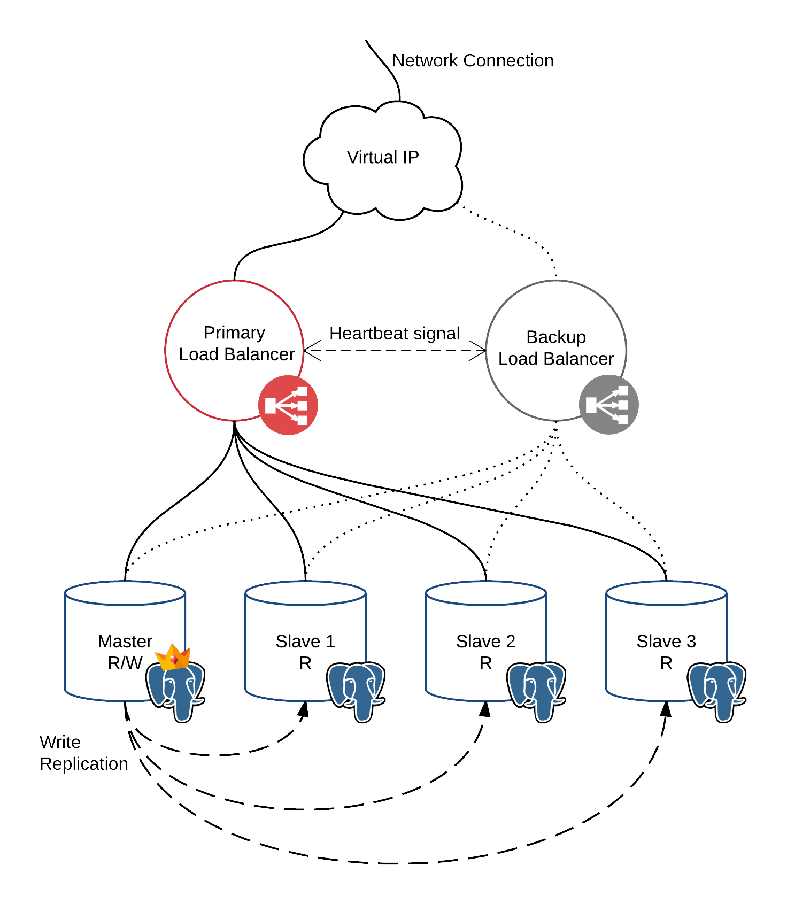

# Project Description
This project is the main objective of my 7 week internship at [Multicert](www.multicert.com).

The aim of this project is to make a user transparent database system capable of losing at least one machine with minimal or zero downtime that also uses the redundant machines to improve performance. These objectives are limited to the local network, meaning that making the internet access redundant is beyond the scope of the project.

# Project Goals
- No single points of failure
- Automated failover (stand-by machines can take over the tasks of the failed machine)
- Improved performance by using an Active/Active arquitecture (make stanby-machines useful)
- Transparent to the client, it should't be any different to access than a simple one machine postgreSQL database
- Aim for [five nines reliability](https://en.wikipedia.org/wiki/High_availability#Percentage_calculation "Downtime Table") assuming an aggressive one machine failure per month

# What I used, so you can avoid wasting time if you're using different software :)
- On my PostgreSQL machines I used both CentOS 6.5 and 7.1.1 with PostgreSQL 9.4.4
- For load balancing I used two machines with CentOS 7.1.1 and installed PgPool II 3.4.3
- Automated failover is handled by a custom script that PgPool II runs when a node goes down

# Repository Organization
I'll try to make this as simple to browse and understand as possible, one folder for each machine (I only have on folder for slaves ), each with it's own configuration files and instructions.
This means that there will be some redundancy in the information as some of the configurations are the same for more than one machine but it'll hopefully make it easier to follow.

# System Architecture

# Relevant links
